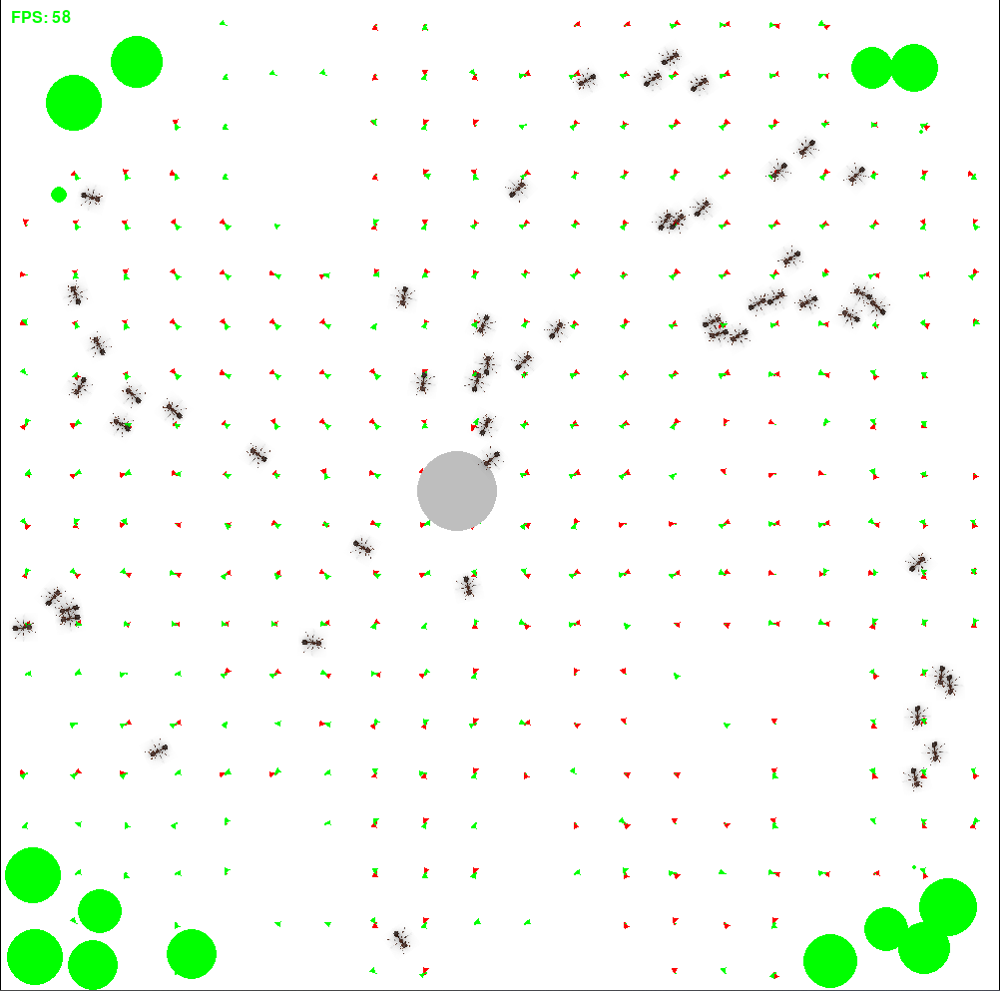

# 🐜 Ants Simulation

Welcome to the **Ants Simulation** — a Python project that simulates ant colony behavior, movement, and scent trail following. This simulation is built using Pygame and NumPy to visualize how individual agents interact with their environment, track scents, search for food, and return to the colony.

 <!-- replace with your actual screenshot path if you add one -->

---

## 📦 Features

- Autonomous ant agents with that wanders, seek, and collecting food
- Scent trail tracking for food and home navigation.
- Spatial grid optimization for efficient environment updates.
- Visual feedback through a dynamic Pygame display.
- Vector grid for scent optimization.

For more info check out the video below
